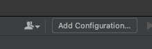

# Configuring for Debugging

## These step are less important with the defaults being created in the init.sh but will help if oyu need to set up from scratch.
### * You should run build/run.sh at least once, as it sets up the database Docker image. *

## JetBrains GoLand

#### At the top click `Add Configuration` 

#### Click the + to add a configuration, then Select `Go Build`

#### In the opened dialog: (Pink should be the GOPATH Red is the service name)
* In the `Files:` box browse to the `server.go` file (or where the `func main()` lives )
* Update the `Output directory:` if you want.
* Fill in the `Working directory:` (can be root of the project)
* `Module` should auto populate

Then click the `Add Environment Variables` Button (Green)

#### Add the necessary Environment variables. These are sufficient for the base service.
* Will nee the `omega-db` container running.

#### Click `OK` then clicking the `Run Arrow`, or `Debug BUG`

## VS Code

#### Click the `Add Configuration` Button on the left menu.

#### Select the `create a launch.json` option.
* This file gets created in your .vscode so isn't checked into Git

####  Select a `Go` profile.

#### Update the launch.json file

* Point `program` to the the `server.go` file (or where the `func main()` lives )
* Update the env, to contain the necessary Environment variables. This example like above assumes the database container is running.

#### Pressing 'Control+Command+D' / `F5` should start the debugging process.

# Debug in Docker

## JetBrains GoLand

_**Disclaimer: This took some hack and slash. If you know a better way, feel free to correct it here, or ping me and I'll update.**_

**I'd prefer to have this all happen in the Dockerfile, but haven't got that ironed out yet.**

_Changes needed for debugging_
1. The built executable needs to run on the same platform as delve.
2. The built executable needs to not be optimized (leaving hte debug info in it) for delve to break in properly.
3. The Dockerfile needs to be launched with some security features turned off, to allow the remote debugging.
4. ...

#### For (1,2) I created a separate build.sh build_debug.sh which changes the pre-compile from:
`CGO_ENABLED=0 go build -a -ldflags "-s" -installsuffix cgo -o bin/app src/main/*.go`
to
`CGO_ENABLED=0 env GOOS=linux GOARCH=amd64 go build -gcflags="all=-N -l" -o bin/app_debug src/main/*.go`
* The `env GOOS=linux GOARCH=amd64` made it runnable on the same platform as Delve
* The `-gcflags="all=-N -l"` Left the debug info in.
* Renamed the executable to `app_debug` for clarity 
* The removed parts were to match up with examples. **Need to verify.**

#### For (3) I created an alternate Dockerfile -> Dockerfile.debug 
Not much remains the same. Tried to comment so the reason for changes would be obvious.

